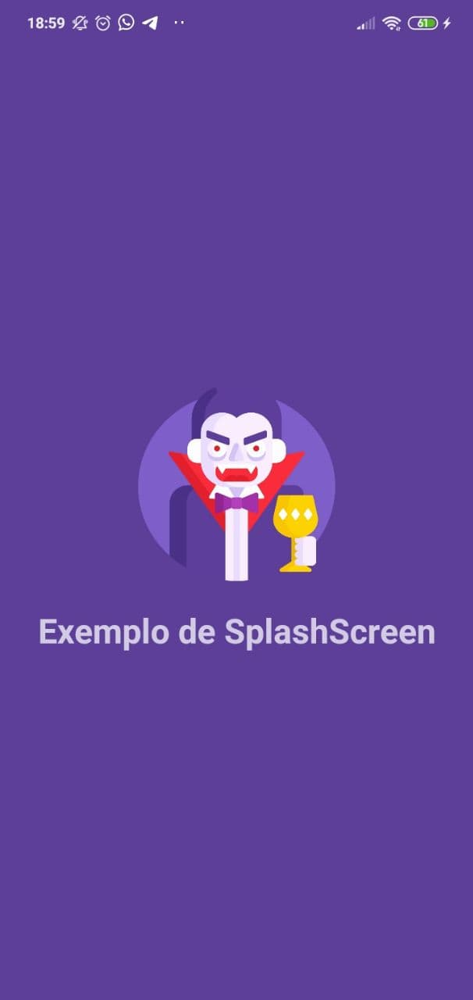
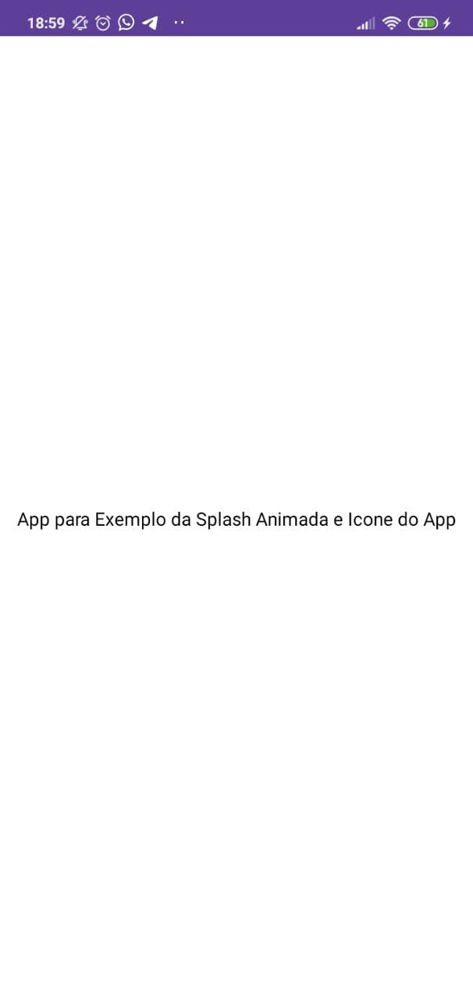

  <h1>
    
    SplashScreen
  </h1>

  📱 Estudo sobre SplashScreen e Criação de Ícone principal do aplicativo

  

  

## 🖼️ Preview

 

  
  

 

## 🏭 Tecnologias Utilizadas

Foram utilizadas as seguintes tecnologias:

- **[Typescript](https://www.typescriptlang.org/)**
- **[React Native](https://reactnative.dev/)**
- **[React Navigation](https://reactnavigation.org/)**
- **[Styled Components](https://styled-components.com/)**

## 🔍 Links de Referência

- **[Video da Rocketseat](https://www.youtube.com/watch?v=3Gf9yb53bJM&list=WL&index=14)**
- **[Ferramenta de geração de ícones](https://apetools.webprofusion.com/#/tools/imagegorilla)**

## 📖 Licença

Realizado em 2020

Esse projeto está licenciado pela MIT LICENSE. Para mais informações, leia o arquivo [LICENSE](./LICENSE.md).
